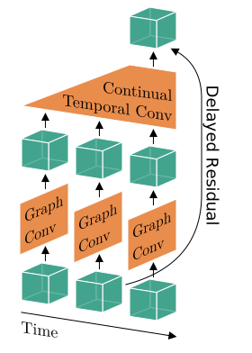
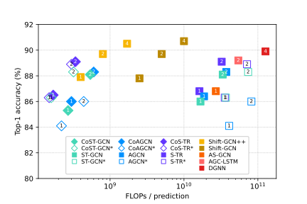
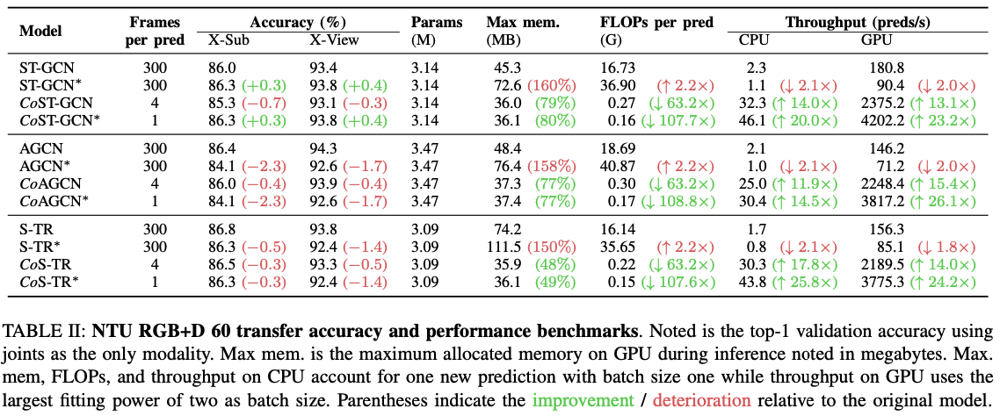
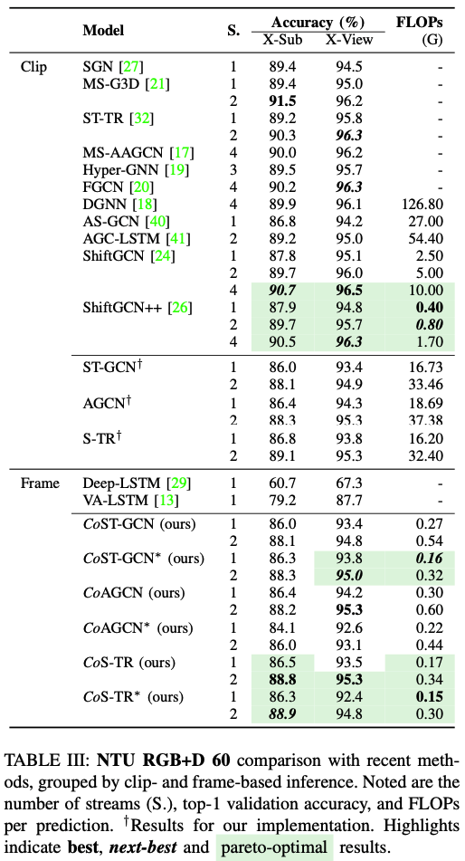
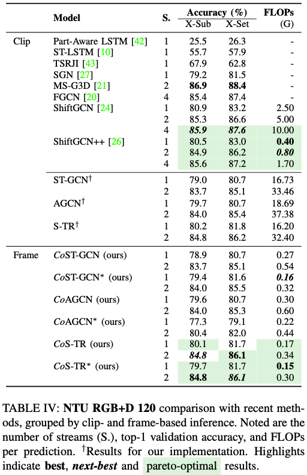
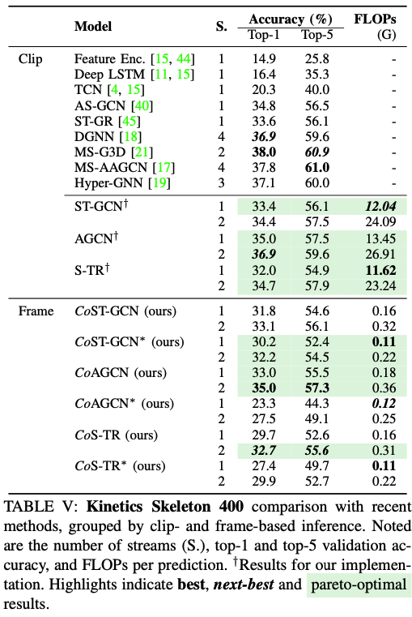

# Continual Spatio-Temporal Graph Convolutional Networks

[](https://arxiv.org/abs/2203.11009)
[](https://opensource.org/licenses/Apache-2.0)
[](https://github.com/LukasHedegaard/ride)
[](https://github.com/psf/black)
<!-- [](https://codecov.io/gh/LukasHedegaard/continual-skeletons) -->
<!-- [](https://papers.nips.cc/book/advances-in-neural-information-processing-systems-31-2018) -->

Official codebase for ["Online Skeleton-based Action Recognition with Continual Spatio-Temporal Graph Convolutional Networks"](https://arxiv.org/abs/2203.11009), including:

- Models: 
[_Co_ ST-GCN](models/cost_gcn/cost_gcn.py),
[_Co_ AGCN](models/coa_gcn/coa_gcn.py),
[_Co_ S-TR](models/cos_tr/cos_tr.py), and more ... (see _Models_ section for full overview).


- Datasets: 
NTU RGB+D 60,
NTU RGB+D 120, and
Kinetics Skeleton 400.


## Abstract
Graph-based reasoning over skeleton data has emerged as a promising approach for human action recognition. However, the application of prior graph-based methods, which predominantly employ whole temporal sequences as their input, to the setting of online inference entails considerable computational redundancy. In this paper, we tackle this issue by reformulating the Spatio-Temporal Graph Convolutional Neural Network as a Continual Inference Network, which can perform step-by-step predictions in time without repeat frame processing. To evaluate our method, we create a continual version of ST-GCN, CoST-GCN, alongside two derived methods with different self-attention mechanisms, CoAGCN and CoS-TR. We investigate weight transfer strategies and architectural modifications for inference acceleration, and perform experiments on the NTU RGB+D 60, NTU RGB+D 120, and Kinetics Skeleton 400 datasets. Retaining similar predictive accuracy, we observe up to 109x reduction in time complexity, on-hardware accelerations of 26x, and reductions in maximum allocated memory of 52% during online inference.


<div align="center">

<br>
Fig. 1: Continual Spatio-temporal Graph Convolution Blocks consist of an in-time Graph Convolution followed by an across-time Continual Convolution (here a kernel size of three is depicted). The residual connection is delayed to ensure temporal alignment with the continual temporal convolution that is weight-compatible with non-continual networks.
</div>

<div align="center">

<br>
Fig. 2: Accuracy/complexity trade-off on NTU RGB+D 60 X-Sub for ⬥ Continual and ■ prior methods during online inference.
Numbers denote streams for each method.
*Architecture modification with stride one and no padding.
</div>

## Setup
### Installation
- Clone this repository and enter it: 
    ```bash
    git clone https://github.com/LukasHedegaard/continual-skeletons.git
    cd continual-skeletons
    ```
- Optionally create and activate conda environment:
    ```bash
    conda create --name continual-skeletons python=3.8
    conda activate continual-skeletons
    ```
- Install as editable module
    ```bash
    pip install -e .[dev]
    ```


## Repository structure
The repository is s
```python
root
|- datasets/     # Dataset loaders
|- models/       # Individual models and shared base-code
    |- ...
    |- st_gcn/       # Baseline model
    |- cost_gcn/     # Continual version of model
    |- st_gcn_mod/   # Modified baseline with stride one and no padding
    |- cost_gcn_mod/ # Continual version of modified baseline model
        |- cost_gcn_mod.py  # Python entry-point
        |- scripts/         # Scripts used to achieve results from paper. Please run from root.
            |- evaluate_ntu60.py
            |- evaluate_ntu120.py
            |- evaluate_kinetics.py
            |- ...
|- tests/     # Unit tests for custom modules
|- weights/   # Place pretrained weights here
|- preds/     # Place extracted predictions here to perform multi-stream eval
|- Makefile   # Commands for testing, linting, cleaning.
|- .env       # Modify path to your dataset here, i.e. DATASETS_PATH=/my/path
```

## Dataset preparation
Download the skeleton data of NTU-RGBD-60 and NTU-RGBD-120 from [here](https://rose1.ntu.edu.sg/dataset/actionRecognition/) and put them in [nturgbd_raw](datasets/data_preparation/nturgbd_raw) directory.
Name the folder of the downloaded skeletons folder for NTU-RGBD-60 and NTU-RGBD-120 as `nturgb+d_skeletons60`, `nturgb+d_skeletons120`, respectively. 
The skeleton data for [Kinetics](https://arxiv.org/pdf/1705.06950.pdf) dataset is extracted using [Openpose](https://github.com/CMU-Perceptual-Computing-Lab/openpose) toolbox by [ST-GCN](https://github.com/yysijie/st-gcn) authors. 
The extracted skeleton data called Kinetics-skeleton (7.5GB) can be directly downloaded from [GoogleDrive](https://drive.google.com/drive/folders/1SPQ6FmFsjGg3f59uCWfdUWI-5HJM_YhZ), and it should be placed in [kinetics_raw](datasets/data_preparation/kinetics_raw) directory. 

Before training and testing the models, the datasets should be preprocessed. The downloaded data should be placed in the following directories:

```python
root
|- datasets/     
|- data_preparation/       
    |- nturgbd_raw\        # Raw NTU-RGBD skeleton data
        |- nturgb+d_skeletons60\   # Skeleton data for NTU-RGBD-60
        |- nturgb+d_skeletons120\   # Skeleton data for NTU-RGBD-120
        |- ...
        |- ntu60_samples_with_missing_skeletons.txt   # Sample IDs with missing skeletons in NTU-RGBD-60
        |- ntu120_samples_with_missing_skeletons.txt  # Sample IDs with missing skeletons in NTU-RGBD-120
  
   |- kinetics_raw\         # Raw Kinetics data
        |- kinetics_train\
        |- ...
        |- kinetics_val\
        |- ...
        |- kinetics_train_label.json
        |- kinetics_val_label.json

```
For generating the preprocedded data you need to run the following commands: 

```bash
# NTU-RGBD-60
python datasets/data_preparation/ntu60_prep.py 
# NTU-RGBD-120
python datasets/data_preparation/ntu120_prep.py 
# Kinetics
python datasets/data_preparation/kinetics400_prep.py 
```

For generating bone and motion data for each of the datasets run the following commands:
```bash
# Bone generation
python datasets/data_preparation/bone_data_prep.py 
# Motion generation
python datasets/data_preparation/motion_data_prep.py 
```

The joint and bone skeleton data can be concatenated by running the following command: 
```bash
# joint_bone data concatenation
python datasets/data_preparation/merge_joint_bone_data.py 
```


## Models
Individual folders with relevant scripts are avilable under `/models` for the following models:
- [ST-GCN](models/st_gcn/st_gcn.py) (baseline)
- [ST-GCN*](models/st_gcn_mod/st_gcn_mod.py)
- [_Co_ ST-GCN](models/cost_gcn/cost_gcn.py)
- [_Co_ ST-GCN*](models/cost_gcn_mod/cost_gcn_mod.py)
- [AGCN](models/a_gcn/a_gcn.py) (baseline)
- [AGCN*](models/a_gcn_mod/a_gcn_mod.py)
- [_Co_ AGCN](models/coa_gcn/coa_gcn.py)
- [_Co_ AGCN*](models/coa_gcn_mod/coa_gcn_mod.py)
- [S-TR](models/s_tr/s_tr.py) (baseline)
- [S-TR*](models/s_tr_mod/s_tr_mod.py)
- [_Co_ S-TR](models/cos_tr/cos_tr.py)
- [_Co_ S-TR*](models/cos_tr_mod/cos_tr_mod.py)

To see an overview of available commands for a model, check the help, e.g.: 
```bash
python models/cost_gcn/cost_gcn.py --help
```

The commands used to produce the paper results are found in the associated scripts folder, e.g.:
```bash
python models/cost_gcn/scripts/evaluate_ntu60.py
```

### Pretrained weights
Trained model weights are available [here](https://drive.google.com/drive/folders/1m6aV5Zv8tAytvxF6qY4m9nyqlkKv0y72?usp=sharing).


## Experiments and results
To reproduce results:
- Prepare datasets
    - Download and preprocessing guidelines coming up
    - Add `DATASET_PATH=/your/dataset/path` to `.env`.
- Download [pretrained weights](https://drive.google.com/drive/folders/1m6aV5Zv8tAytvxF6qY4m9nyqlkKv0y72) and place them in `~/weights`.
- Run evaluation script. For instance, to evaluate the CoST-GCN* model on NTU RGB+D 120 and save its predictions, the command would be:
    ```bash
    python models/cost_gcn/scripts/evaluate_ntu120.py
    ```

### Benchmark
<div align="center">  </div>

### NTU RGB+D 60
<div align="center">  </div>

### NTU RGB+D 120
<div align="center">  </div>

### Kinetics Skeletons 400
<div align="center">  </div>

## Citation

```bibtex
@article{hedegaard2022online,
  title={Online Skeleton-based Action Recognition with Continual Spatio-Temporal Graph Convolutional Networks},
  author={Lukas Hedegaard and Negar Heidari and Alexandros Iosifidis},
  journal={preprint, arXiv: 2203.11009}, 
  year={2022}
}
```
